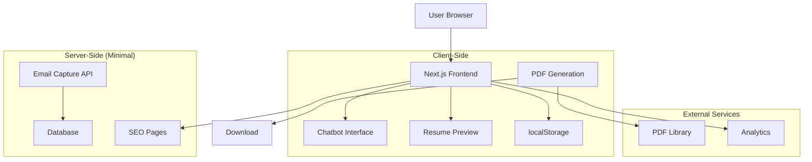

# Design Document

## Overview

ATS Resume Chatbot is a Next.js application that provides a conversational interface for building ATS-friendly resumes. The system uses client-side storage for privacy and SEO benefits, implements adaptive questioning based on user background, and only requires signup at download. The architecture prioritizes fast loading, search engine optimization, and lead capture through a freemium model.

## Architecture

### High-Level Architecture



### Technology Stack

- **Frontend**: Next.js 14 with App Router, React, TypeScript, Tailwind CSS
- **State Management**: React Context + localStorage for persistence
- **PDF Generation**: jsPDF or Puppeteer for client-side PDF creation
- **Database**: Supabase PostgreSQL (minimal - only for email capture)
- **Styling**: Tailwind CSS with custom chatbot components
- **Analytics**: Vercel Analytics + Google Analytics for SEO tracking
- **Deployment**: Vercel with custom domain

## Components and Interfaces

### Frontend Components

#### 1. Landing Page (`app/page.tsx`)
```typescript
interface LandingPageProps {
  seoContent: {
    title: string;
    description: string;
    keywords: string[];
    structuredData: object;
  };
}
```
- SEO-optimized static content
- Hero section with resume builder benefits
- Feature highlights and testimonials
- Call-to-action to start chatbot
- FAQ section for search engine content

#### 2. Chatbot Interface (`app/components/ChatbotInterface.tsx`)
```typescript
interface ChatMessage {
  id: string;
  type: 'bot' | 'user';
  content: string;
  timestamp: Date;
  metadata?: {
    field?: string;
    section?: string;
    isRequired?: boolean;
  };
}

interface ChatbotState {
  messages: ChatMessage[];
  currentSection: ResumeSection;
  userProfile: UserProfile;
  resumeData: ResumeData;
  isComplete: boolean;
}

interface UserProfile {
  background: 'tech' | 'non-tech';
  experience: 'fresher' | 'experienced';
  preferences: {
    skipOptional: boolean;
    fastMode: boolean;
  };
}
```

#### 3. Adaptive Question Engine (`app/lib/questionEngine.ts`)
```typescript
interface Question {
  id: string;
  text: string;
  type: 'text' | 'email' | 'number' | 'date' | 'textarea' | 'select';
  field: string;
  section: ResumeSection;
  required: boolean;
  skipConditions?: SkipCondition[];
  validation?: ValidationRule[];
  followUp?: string[];
}

interface SkipCondition {
  field: string;
  value: any;
  operator: 'equals' | 'not_equals' | 'contains';
}

type ResumeSection = 
  | 'classification'
  | 'basic_info'
  | 'education'
  | 'experience'
  | 'projects'
  | 'skills'
  | 'achievements'
  | 'social_links'
  | 'ai_upsell'
  | 'complete';
```

#### 4. Resume Data Model (`app/lib/types.ts`)
```typescript
interface ResumeData {
  basicInfo: {
    fullName: string;
    email: string;
    phone: string;
    location?: string;
    headline?: string;
    summary?: string;
  };
  education: EducationEntry[];
  experience: ExperienceEntry[];
  projects: ProjectEntry[];
  skills: {
    primary: string[];
    secondary?: string[];
    techStack?: string[];
    businessTools?: string[];
  };
  achievements: {
    certifications?: string[];
    achievements?: string[];
    extracurricular?: string[];
  };
  socialLinks: {
    linkedin?: string;
    github?: string;
    website?: string;
  };
  metadata: {
    background: 'tech' | 'non-tech';
    experience: 'fresher' | 'experienced';
    completedSections: ResumeSection[];
    createdAt: Date;
    updatedAt: Date;
  };
}

interface EducationEntry {
  degree: string;
  institution: string;
  startYear?: number;
  endYear?: number;
  marks?: string;
  specialization?: string;
}

interface ExperienceEntry {
  companyName: string;
  role: string;
  startDate?: string;
  endDate?: string;
  achievements?: string[];
  toolsUsed?: string[];
}

interface ProjectEntry {
  title: string;
  description?: string;
  techStack?: string[];
  link?: string;
  role?: string;
}
```

#### 5. Resume Preview (`app/components/ResumePreview.tsx`)
```typescript
interface ResumePreviewProps {
  resumeData: ResumeData;
  template: 'ats-standard' | 'ats-modern' | 'ats-minimal';
  showATSScore: boolean;
}

interface ATSScore {
  overall: number;
  factors: {
    formatting: number;
    keywords: number;
    structure: number;
    readability: number;
  };
  suggestions: string[];
}
```

#### 6. PDF Generator (`app/lib/pdfGenerator.ts`)
```typescript
interface PDFGeneratorOptions {
  template: string;
  atsOptimized: boolean;
  includeATSScore: boolean;
  watermark?: string;
}

interface PDFResult {
  success: boolean;
  blob?: Blob;
  error?: string;
  atsScore?: ATSScore;
}
```

### Question Flow Engine

#### 1. Classification Questions
```typescript
const classificationQuestions: Question[] = [
  {
    id: 'background',
    text: 'Are you from a Tech background or Non-Tech background?',
    type: 'select',
    field: 'background',
    section: 'classification',
    required: true,
    options: ['Tech', 'Non-Tech']
  },
  {
    id: 'experience_level',
    text: 'Are you a Fresher or Experienced professional?',
    type: 'select',
    field: 'experience',
    section: 'classification',
    required: true,
    options: ['Fresher', 'Experienced']
  }
];
```

#### 2. Adaptive Section Logic
```typescript
const sectionLogic = {
  experience: {
    show: (profile: UserProfile) => profile.experience === 'experienced',
    required: true
  },
  projects: {
    show: (profile: UserProfile) => 
      profile.background === 'tech' || profile.experience === 'fresher',
    required: false
  },
  techStack: {
    show: (profile: UserProfile) => profile.background === 'tech',
    required: false
  },
  businessTools: {
    show: (profile: UserProfile) => profile.background === 'non-tech',
    required: false
  }
};
```

### API Endpoints (Minimal Server-Side)

#### 1. Email Capture API (`app/api/capture-email/route.ts`)
```typescript
interface EmailCaptureRequest {
  email: string;
  type: 'download' | 'ai_interest';
  resumeMetadata?: {
    sections: string[];
    background: string;
    experience: string;
  };
}

interface EmailCaptureResponse {
  success: boolean;
  message: string;
  downloadToken?: string;
}
```

#### 2. Analytics API (`app/api/analytics/route.ts`)
```typescript
interface AnalyticsEvent {
  event: string;
  properties: {
    section?: string;
    background?: string;
    experience?: string;
    timestamp: Date;
  };
}
```

## Data Models

### Database Schema (Minimal)

#### Email Captures Table
```sql
CREATE TABLE email_captures (
  id UUID PRIMARY KEY DEFAULT gen_random_uuid(),
  email VARCHAR(255) NOT NULL,
  capture_type VARCHAR(20) NOT NULL, -- 'download' or 'ai_interest'
  resume_metadata JSONB,
  created_at TIMESTAMP WITH TIME ZONE DEFAULT NOW(),
  source VARCHAR(50) DEFAULT 'chatbot'
);

CREATE INDEX idx_email_captures_email ON email_captures(email);
CREATE INDEX idx_email_captures_type ON email_captures(capture_type);
CREATE INDEX idx_email_captures_created ON email_captures(created_at);
```

#### Analytics Events Table
```sql
CREATE TABLE analytics_events (
  id UUID PRIMARY KEY DEFAULT gen_random_uuid(),
  event_name VARCHAR(100) NOT NULL,
  properties JSONB,
  session_id VARCHAR(100),
  created_at TIMESTAMP WITH TIME ZONE DEFAULT NOW()
);

CREATE INDEX idx_analytics_events_name ON analytics_events(event_name);
CREATE INDEX idx_analytics_events_created ON analytics_events(created_at);
```

### localStorage Schema

```typescript
interface LocalStorageData {
  resumeData: ResumeData;
  chatHistory: ChatMessage[];
  userProfile: UserProfile;
  progress: {
    currentSection: ResumeSection;
    completedSections: ResumeSection[];
    lastUpdated: Date;
  };
  preferences: {
    theme: 'light' | 'dark';
    language: string;
    notifications: boolean;
  };
}
```

## Error Handling

### Client-Side Error Handling
- localStorage failure fallback to sessionStorage
- Graceful degradation for unsupported browsers
- Offline functionality with service workers
- Form validation with real-time feedback
- PDF generation error recovery

### Chatbot Error Handling
- Invalid input recovery with helpful suggestions
- Context preservation during errors
- Retry mechanisms for failed operations
- Progress saving before each question
- Graceful handling of incomplete responses

## Testing Strategy

### Unit Testing
- Question engine logic testing
- Resume data validation testing
- PDF generation testing
- localStorage operations testing
- Component rendering testing

### Integration Testing
- Complete chatbot flow testing
- Email capture flow testing
- Resume preview generation testing
- Cross-browser compatibility testing
- Mobile responsiveness testing

### User Experience Testing
- Conversation flow usability testing
- ATS optimization validation
- Performance testing for large resumes
- Accessibility compliance testing
- SEO effectiveness testing

## SEO Optimization

### Technical SEO
```typescript
interface SEOConfig {
  metadata: {
    title: string;
    description: string;
    keywords: string[];
    openGraph: OpenGraphData;
    twitter: TwitterCardData;
  };
  structuredData: {
    '@type': 'WebApplication';
    name: string;
    description: string;
    applicationCategory: 'BusinessApplication';
    offers: OfferData;
  };
  sitemap: SitemapEntry[];
  robots: RobotsConfig;
}
```

### Content Strategy
- Static pages for resume tips and guides
- FAQ section with common resume questions
- Blog integration for SEO content
- Landing pages for different user segments
- Schema markup for better search visibility

## Performance Optimization

### Frontend Performance
- Code splitting by route and component
- Lazy loading for non-critical components
- Image optimization with Next.js Image
- Bundle size optimization
- Service worker for caching

### Client-Side Storage
- Efficient localStorage usage with compression
- Data cleanup and garbage collection
- Progressive data loading
- Optimistic UI updates
- Background data synchronization

## Security Considerations

### Data Privacy
- Client-side data encryption
- No sensitive data transmission during building
- GDPR compliance for email collection
- Clear privacy policy and data usage
- User consent management

### Application Security
- Input sanitization and validation
- XSS prevention in chat interface
- CSRF protection for API endpoints
- Rate limiting for email capture
- Secure PDF generation

## Deployment and Infrastructure

### Vercel Configuration
```javascript
// vercel.json
{
  "functions": {
    "app/api/**/*.ts": {
      "maxDuration": 10
    }
  },
  "headers": [
    {
      "source": "/(.*)",
      "headers": [
        {
          "key": "X-Content-Type-Options",
          "value": "nosniff"
        },
        {
          "key": "X-Frame-Options",
          "value": "DENY"
        }
      ]
    }
  ]
}
```

### Environment Variables
- `NEXT_PUBLIC_SUPABASE_URL`: Supabase project URL
- `NEXT_PUBLIC_SUPABASE_ANON_KEY`: Supabase anonymous key
- `SUPABASE_SERVICE_ROLE_KEY`: Supabase service role key
- `NEXT_PUBLIC_GA_ID`: Google Analytics ID
- `WEBHOOK_SECRET`: For future integrations

### Monitoring and Analytics
- Vercel Analytics for performance monitoring
- Google Analytics for user behavior tracking
- Custom analytics for chatbot interactions
- Error tracking with Sentry
- Conversion tracking for email captures