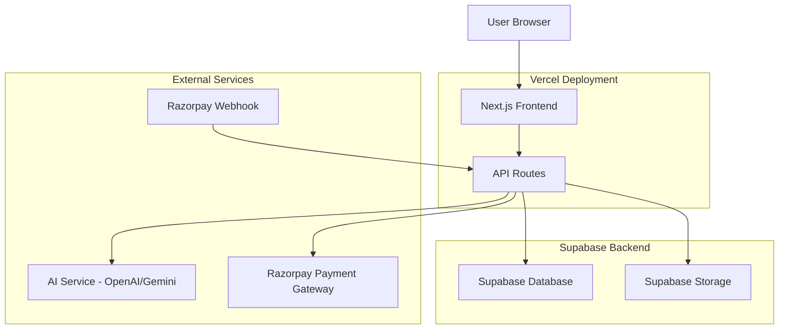

# Design Document

## Overview

CrackBase Resume AI is built as a Next.js application using the app router, deployed on Vercel with the subdomain `resume.crackbase.in`. The architecture follows a modern serverless approach with Supabase for database and storage, Razorpay for payments, and OpenAI/Gemini for AI-powered content generation. The system is designed for scalability, cost-effectiveness, and seamless user experience.

## Architecture

### High-Level Architecture



### Technology Stack

- **Frontend**: Next.js 14 with App Router, React, TypeScript, Tailwind CSS
- **Backend**: Next.js API Routes (serverless functions)
- **Database**: Supabase PostgreSQL
- **Storage**: Supabase Storage for DOCX files
- **AI**: OpenAI GPT-4o-mini or Google Gemini API
- **Payments**: Razorpay integration
- **Deployment**: Vercel with custom domain
- **Document Generation**: docx library for DOCX creation

## Components and Interfaces

### Frontend Components

#### 1. Landing Page (`app/page.tsx`)
- Hero section with value proposition
- Pricing display (₹49 one-time)
- Call-to-action button to start resume building
- Social proof and testimonials section
- Features overview

#### 2. Resume Form (`app/components/ResumeForm.tsx`)
```typescript
interface ResumeFormData {
  personalInfo: {
    name: string;
    email: string;
    phone: string;
    address: string;
    linkedin?: string;
    github?: string;
  };
  education: Array<{
    institution: string;
    degree: string;
    field: string;
    year: string;
    gpa?: string;
  }>;
  skills: {
    technical: string[];
    soft: string[];
  };
  experience: Array<{
    title: string;
    company: string;
    duration: string;
    responsibilities: string[];
  }>;
  projects: Array<{
    name: string;
    description: string;
    technologies: string[];
    duration: string;
    link?: string;
  }>;
  achievements: string[];
}
```

#### 3. Resume Preview (`app/components/ResumePreview.tsx`)
- Displays AI-generated resume with professional formatting
- Includes preview watermark overlay
- Shows payment button when preview is ready
- Responsive design for mobile and desktop

#### 4. Payment Component (`app/components/PaymentButton.tsx`)
- Integrates Razorpay checkout
- Handles payment success/failure states
- Updates UI based on payment status

#### 5. Download Component (`app/components/ResumeDownload.tsx`)
- Enabled only after successful payment
- Triggers DOCX file generation and download
- Shows download progress and success states

### API Endpoints

#### 1. Resume Generation API (`app/api/generate-resume/route.ts`)
```typescript
interface GenerateResumeRequest {
  formData: ResumeFormData;
  userId: string;
}

interface GenerateResumeResponse {
  success: boolean;
  resumeText: string;
  previewId: string;
  error?: string;
}
```

#### 2. Payment Creation API (`app/api/payment/create/route.ts`)
```typescript
interface CreatePaymentRequest {
  userId: string;
  resumeId: string;
  amount: number; // 4900 (₹49 in paise)
}

interface CreatePaymentResponse {
  orderId: string;
  amount: number;
  currency: string;
  key: string;
}
```

#### 3. Payment Webhook (`app/api/payment/webhook/route.ts`)
```typescript
interface WebhookPayload {
  event: string;
  payload: {
    payment: {
      entity: RazorpayPayment;
    };
    order: {
      entity: RazorpayOrder;
    };
  };
}
```

#### 4. Download API (`app/api/download/route.ts`)
```typescript
interface DownloadRequest {
  userId: string;
  resumeId: string;
}
// Returns DOCX file stream
```

## Data Models

### Database Schema (Supabase)

#### Users Table
```sql
CREATE TABLE users (
  id UUID PRIMARY KEY DEFAULT gen_random_uuid(),
  email VARCHAR(255) UNIQUE NOT NULL,
  created_at TIMESTAMP WITH TIME ZONE DEFAULT NOW(),
  updated_at TIMESTAMP WITH TIME ZONE DEFAULT NOW()
);
```

#### Payments Table
```sql
CREATE TABLE payments (
  id UUID PRIMARY KEY DEFAULT gen_random_uuid(),
  user_id UUID REFERENCES users(id),
  amount INTEGER NOT NULL, -- in paise
  currency VARCHAR(3) DEFAULT 'INR',
  status VARCHAR(50) NOT NULL, -- pending, completed, failed
  razorpay_order_id VARCHAR(255),
  razorpay_payment_id VARCHAR(255),
  razorpay_signature VARCHAR(255),
  created_at TIMESTAMP WITH TIME ZONE DEFAULT NOW(),
  updated_at TIMESTAMP WITH TIME ZONE DEFAULT NOW()
);
```

#### Resumes Table
```sql
CREATE TABLE resumes (
  id UUID PRIMARY KEY DEFAULT gen_random_uuid(),
  user_id UUID REFERENCES users(id),
  form_data JSONB NOT NULL,
  ai_generated_text TEXT NOT NULL,
  file_url VARCHAR(500), -- Supabase Storage URL
  payment_id UUID REFERENCES payments(id),
  created_at TIMESTAMP WITH TIME ZONE DEFAULT NOW(),
  updated_at TIMESTAMP WITH TIME ZONE DEFAULT NOW()
);
```

#### AI Logs Table
```sql
CREATE TABLE ai_logs (
  id UUID PRIMARY KEY DEFAULT gen_random_uuid(),
  user_id UUID REFERENCES users(id),
  resume_id UUID REFERENCES resumes(id),
  model_name VARCHAR(100) NOT NULL,
  tokens_used INTEGER,
  cost_usd DECIMAL(10,6),
  request_type VARCHAR(50), -- generation, revision
  created_at TIMESTAMP WITH TIME ZONE DEFAULT NOW()
);
```

### Storage Structure (Supabase Storage)

```
resume-files/
├── {user_id}/
│   └── {resume_id}/
│       └── resume.docx
```

## Error Handling

### Frontend Error Handling
- Form validation with real-time feedback
- Loading states for all async operations
- Toast notifications for success/error messages
- Retry mechanisms for failed operations
- Graceful degradation for offline scenarios

### Backend Error Handling
- Comprehensive error logging with structured data
- Rate limiting to prevent abuse
- Input validation and sanitization
- Database transaction rollbacks on failures
- Circuit breaker pattern for external API calls

### AI Service Error Handling
- Retry logic with exponential backoff
- Fallback to alternative AI models if primary fails
- Content filtering and safety checks
- Token usage monitoring and limits
- Graceful handling of API rate limits

### Payment Error Handling
- Webhook signature verification
- Idempotent payment processing
- Failed payment retry mechanisms
- Refund handling capabilities
- Fraud detection integration

## Testing Strategy

### Unit Testing
- Component testing with React Testing Library
- API route testing with Jest
- Database model validation testing
- Utility function testing
- Mock external service dependencies

### Integration Testing
- End-to-end user flow testing with Playwright
- Payment flow testing with Razorpay test mode
- AI integration testing with mock responses
- Database integration testing
- File upload/download testing

### Performance Testing
- Load testing for concurrent users
- AI response time optimization
- Database query performance
- File generation speed testing
- CDN and caching effectiveness

### Security Testing
- Input validation and XSS prevention
- SQL injection prevention
- Payment security compliance
- File upload security scanning
- Rate limiting effectiveness

## Deployment and Infrastructure

### Vercel Configuration
```javascript
// vercel.json
{
  "functions": {
    "app/api/**/*.ts": {
      "maxDuration": 30
    }
  },
  "env": {
    "NEXT_PUBLIC_SUPABASE_URL": "@supabase-url",
    "NEXT_PUBLIC_SUPABASE_ANON_KEY": "@supabase-anon-key",
    "SUPABASE_SERVICE_ROLE_KEY": "@supabase-service-key",
    "OPENAI_API_KEY": "@openai-api-key",
    "RAZORPAY_KEY_ID": "@razorpay-key-id",
    "RAZORPAY_KEY_SECRET": "@razorpay-key-secret"
  }
}
```

### Environment Variables
- `NEXT_PUBLIC_SUPABASE_URL`: Supabase project URL
- `NEXT_PUBLIC_SUPABASE_ANON_KEY`: Supabase anonymous key
- `SUPABASE_SERVICE_ROLE_KEY`: Supabase service role key
- `OPENAI_API_KEY`: OpenAI API key for AI generation
- `RAZORPAY_KEY_ID`: Razorpay public key
- `RAZORPAY_KEY_SECRET`: Razorpay secret key
- `WEBHOOK_SECRET`: Razorpay webhook secret

### Monitoring and Analytics
- Vercel Analytics for performance monitoring
- Supabase built-in monitoring for database metrics
- Custom logging for business metrics
- Error tracking with Sentry integration
- Payment analytics dashboard

## Security Considerations

### Data Protection
- HTTPS enforcement across all endpoints
- Input sanitization and validation
- SQL injection prevention through parameterized queries
- XSS protection with Content Security Policy
- Secure file upload with type validation

### Payment Security
- PCI DSS compliance through Razorpay
- Webhook signature verification
- Secure API key management
- Payment data encryption at rest
- Fraud detection and prevention

### User Privacy
- GDPR compliance for EU users
- Data retention policies
- User consent management
- Secure session handling
- Personal data anonymization options

## Performance Optimization

### Frontend Optimization
- Next.js automatic code splitting
- Image optimization with Next.js Image component
- Lazy loading for non-critical components
- Service worker for offline functionality
- CDN delivery through Vercel Edge Network

### Backend Optimization
- Database connection pooling
- Query optimization with proper indexing
- Caching strategies for frequently accessed data
- Serverless function cold start optimization
- File compression for downloads

### AI Integration Optimization
- Request batching where possible
- Response caching for similar inputs
- Token usage optimization
- Model selection based on complexity
- Streaming responses for better UX